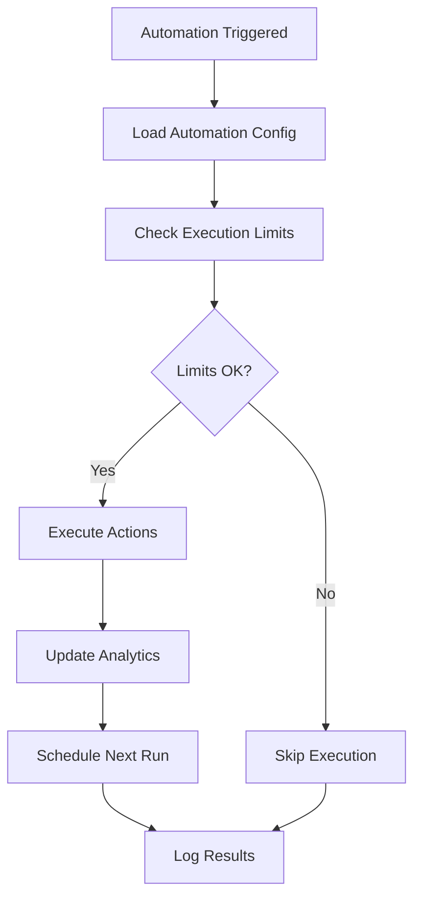

# Automation API Documentation

## Base URL
```
https://api.yourapp.com/api/automations
```

## Table of Contents
- [Automation API Documentation](#automation-api-documentation)
  - [Base URL](#base-url)
  - [Table of Contents](#table-of-contents)
  - [Overview](#overview)
    - [Key Features](#key-features)
    - [Automation Status](#automation-status)
    - [Trigger Types](#trigger-types)
    - [Action Types](#action-types)
    - [Automation Types](#automation-types)
    - [Trigger Types](#trigger-types-1)
    - [Schedule Trigger Configuration](#schedule-trigger-configuration)
  - [Authentication \& Permissions](#authentication--permissions)
  - [Automation Management](#automation-management)
    - [1. Get All Automations](#1-get-all-automations)
    - [2. Get Automation by ID](#2-get-automation-by-id)
    - [3. Create New Automation](#3-create-new-automation)
    - [4. Update Automation](#4-update-automation)
    - [5. Delete Automation](#5-delete-automation)
  - [Automation Templates](#automation-templates)
    - [6. Get All Templates](#6-get-all-templates)
  - [Automation Control](#automation-control)
    - [7. Start Automation](#7-start-automation)
    - [8. Stop Automation](#8-stop-automation)
    - [9. Pause Automation](#9-pause-automation)
    - [10. Execute Automation Manually](#10-execute-automation-manually)
  - [Automation Analytics](#automation-analytics)
    - [11. Get Automation Analytics](#11-get-automation-analytics)
    - [12. Get Automation Statistics Overview](#12-get-automation-statistics-overview)
  - [Workflow Engine](#workflow-engine)
    - [Execution Flow](#execution-flow)
    - [Scheduling System](#scheduling-system)
    - [Execution Limits](#execution-limits)
  - [Data Models](#data-models)
    - [AutomationDocument Interface](#automationdocument-interface)
    - [Trigger Configurations](#trigger-configurations)
    - [Action Configurations](#action-configurations)
    - [Condition Schema](#condition-schema)
    - [Settings Schema](#settings-schema)
  - [Error Responses](#error-responses)
    - [Common Error Codes:](#common-error-codes)
    - [Automation-Specific Errors:](#automation-specific-errors)
  - [Automation Types](#automation-types-1)
    - [Available Automation Types:](#available-automation-types)
    - [Settings Schema by Type:](#settings-schema-by-type)
      - [Like Posts (`like_posts`):](#like-posts-like_posts)
      - [Follow Users (`follow_users`):](#follow-users-follow_users)
      - [Comment Posts (`comment_posts`):](#comment-posts-comment_posts)
  - [Best Practices](#best-practices)
    - [Automation Design](#automation-design)
    - [Security Best Practices](#security-best-practices)
    - [Monitoring and Maintenance](#monitoring-and-maintenance)
  - [Rate Limiting](#rate-limiting)
  - [Security Features](#security-features)
    - [Authentication](#authentication)
    - [Permissions](#permissions)
    - [Data Protection](#data-protection)

---

## Overview

The Automation API provides a comprehensive workflow engine for creating, managing, and executing automated social media tasks. Built with enterprise-grade reliability and scalability, it supports complex automation workflows with advanced scheduling, execution limits, and real-time analytics.

### Key Features

- **🔄 Advanced Workflow Engine**: Sophisticated automation execution with trigger-based workflows
- **⏰ Intelligent Scheduling**: Cron-based scheduling with timezone support and execution limits
- **📊 Real-time Analytics**: Comprehensive execution tracking and performance metrics
- **🎯 Multi-Platform Support**: Seamless integration across multiple social media platforms
- **🛡️ Enterprise Security**: Role-based permissions and secure execution environment
- **⚡ High Performance**: Optimized for scale with efficient resource management
- **🔧 Template System**: Pre-built automation templates for quick setup
- **📈 Execution Monitoring**: Real-time status tracking and error handling
- **🔀 Multi-Account Support**: Support for multiple platform accounts per automation
- **🎛️ Advanced Filtering**: Sophisticated filtering for triggers and conditions
- **📝 Variable Support**: Dynamic content with variable substitution

### Automation Status

| Status      | Description                                           | Behavior                                      |
| ----------- | ----------------------------------------------------- | --------------------------------------------- |
| `draft`     | Automation is in draft mode                           | Not executing, can be edited freely           |
| `active`    | Automation is running and executing based on triggers | Scheduled executions will run automatically   |
| `paused`    | Automation is temporarily paused                      | Can be resumed without losing configuration   |
| `stopped`   | Automation is stopped and will not execute            | No executions will occur                      |
| `completed` | Automation has finished all scheduled executions      | Automatically set when max executions reached |
| `failed`    | Automation encountered critical errors and stopped    | Requires manual intervention                  |

### Trigger Types

| Type                          | Code                         | Description                                          | Configuration                         |
| ----------------------------- | ---------------------------- | ---------------------------------------------------- | ------------------------------------- |
| **Instagram Message**         | `instagram.message_received` | Triggered when Instagram message is received         | keywords, senderFilters, exactMatch   |
| **Instagram Comment**         | `instagram.comment_received` | Triggered when comment is received on Instagram post | keywords, mediaIds, authorFilters     |
| **Instagram Mention**         | `instagram.mention_received` | Triggered when mentioned in Instagram content        | keywords, mentionTypes, authorFilters |
| **Instagram Story Mention**   | `instagram.story_mention`    | Triggered when mentioned in Instagram story          | keywords, authorFilters               |
| **Instagram Media Published** | `instagram.media_published`  | Triggered when new media is published                | mediaTypes, hashtags                  |
| **Schedule Time-Based**       | `schedule.time_based`        | One-time execution at specific date/time             | executeAt, timezone                   |
| **Schedule Recurring**        | `schedule.recurring`         | Recurring execution with cron pattern                | cron, timezone, startDate, endDate    |
| **Manual Trigger**            | `manual.trigger`             | Manually triggered execution                         | No configuration required             |

### Action Types

| Type                        | Code                         | Description                            | Configuration                           |
| --------------------------- | ---------------------------- | -------------------------------------- | --------------------------------------- |
| **Instagram Send Message**  | `instagram.send_message`     | Send direct message on Instagram       | messageType, content, delay             |
| **Instagram Reply Comment** | `instagram.reply_to_comment` | Reply to Instagram comment             | replyText, useVariables, delay          |
| **Instagram Like Comment**  | `instagram.like_comment`     | Like Instagram comment                 | delay                                   |
| **Instagram Hide Comment**  | `instagram.hide_comment`     | Hide Instagram comment                 | reason, delay                           |
| **Instagram Publish Post**  | `instagram.publish_post`     | Publish new Instagram post             | mediaType, mediaUrls, caption, hashtags |
| **Instagram Publish Story** | `instagram.publish_story`    | Publish Instagram story                | mediaUrls, duration, stickers           |
| **Save to CRM**             | `internal.save_to_crm`       | Save contact information to CRM        | fields, useVariables                    |
| **Send Notification**       | `internal.send_notification` | Send notification via various channels | notificationType, recipients, message   |
| **Webhook Call**            | `internal.webhook_call`      | Make HTTP request to external webhook  | url, method, headers, body              |
| **Track Engagement**        | `analytics.track_engagement` | Track engagement metrics               | eventName, properties                   |
| **Generate Report**         | `analytics.generate_report`  | Generate analytics report              | reportType, metrics, recipients         |

### Automation Types

| Type | Code | Description | Use Cases |
| ---- | ---- | ----------- | --------- ||
| **Post Scheduling** | `POST_SCHEDULING` | Schedule posts for future publication | Content calendar management, optimal timing |
| **Auto Reply** | `AUTO_REPLY` | Automatically respond to comments and messages | Customer service, engagement automation |
| **Content Curation** | `CONTENT_CURATION` | Automatically curate and share relevant content | Content discovery, reposting |
| **Engagement** | `ENGAGEMENT` | Automate likes, follows, and other engagement activities | Audience growth, community building |
| **Analytics Report** | `ANALYTICS_REPORT` | Generate and send periodic analytics reports | Performance tracking, insights delivery |
| **Cross Posting** | `CROSS_POSTING` | Share content across multiple platforms | Multi-platform presence, content syndication |

### Trigger Types

| Type                    | Code                  | Description                                       | Configuration                                   |
| ----------------------- | --------------------- | ------------------------------------------------- | ----------------------------------------------- |
| **Schedule Time-Based** | `schedule.time_based` | One-time execution at specific date/time          | executeAt (Date), timezone                      |
| **Schedule Recurring**  | `schedule.recurring`  | Recurring execution with cron pattern             | cronPattern, startDate, endDate, timezone       |
| **Event**               | `EVENT`               | Triggered by platform events (comments, mentions) | Event types, filters, conditions                |
| **Condition**           | `CONDITION`           | Triggered when specific conditions are met        | Condition logic, thresholds, operators          |
| **Webhook**             | `WEBHOOK`             | Triggered by external webhook calls               | Webhook URL, authentication, payload validation |

### Schedule Trigger Configuration

**Time-Based Schedule:**
```typescript
{
  type: "schedule.time_based",
  config: {
    executeAt: Date,  // Specific execution time
    timezone?: string // Optional timezone (default: UTC)
  }
}
```

**Recurring Schedule:**
```typescript
{
  type: "schedule.recurring", 
  config: {
    cronPattern: string,    // Cron expression (e.g., "0 9 * * 1-5")
    startDate?: Date,       // Optional start date
    endDate?: Date,         // Optional end date
    timezone?: string       // Optional timezone (default: UTC)
  }
}
```

## Authentication & Permissions

All automation endpoints require authentication and specific permissions:

| Permission           | Description                   | Required For                                         |
| -------------------- | ----------------------------- | ---------------------------------------------------- |
| `AUTOMATION_LIST`    | View automation list          | GET /automations                                     |
| `AUTOMATION_READ`    | View automation details       | GET /automations/:id, GET /templates                 |
| `AUTOMATION_CREATE`  | Create new automations        | POST /automations                                    |
| `AUTOMATION_UPDATE`  | Modify existing automations   | PUT /automations/:id                                 |
| `AUTOMATION_DELETE`  | Delete automations            | DELETE /automations/:id                              |
| `AUTOMATION_EXECUTE` | Control automation execution  | POST /automations/:id/start, /stop, /pause, /execute |
| `ANALYTICS_READ`     | View analytics and statistics | GET /automations/:id/analytics, /stats/overview      |

---

## Automation Management

### 1. Get All Automations

**Endpoint:** `GET /api/automations`  
**Description:** Retrieve a paginated list of all automations for the authenticated user with advanced filtering and sorting options.  
**Authentication:** Required  
**Permission:** `AUTOMATION_LIST`

**Query Parameters:**

| Parameter     | Type    | Default     | Description                                                                                   |
| ------------- | ------- | ----------- | --------------------------------------------------------------------------------------------- |
| `page`        | integer | 1           | Page number for pagination                                                                    |
| `limit`       | integer | 10          | Number of items per page (max: 100)                                                           |
| `status`      | string  | -           | Filter by status: `ACTIVE`, `INACTIVE`, `PAUSED`, `COMPLETED`, `FAILED`                       |
| `platform`    | string  | -           | Filter by platform: `instagram`, `facebook`, `twitter`, `linkedin`                            |
| `triggerType` | string  | -           | Filter by trigger type: `instagram.message`, `instagram.comment`, `schedule.time_based`, etc. |
| `search`      | string  | -           | Search in name, description, and tags                                                         |
| `sortBy`      | string  | `createdAt` | Sort field: `createdAt`, `updatedAt`, `name`, `status`, `lastExecutedAt`                      |
| `sortOrder`   | string  | `desc`      | Sort order: `asc`, `desc`                                                                     |

**Example Request:**
```bash
curl -X GET "https://api.yourapp.com/api/automations?page=1&limit=10&status=ACTIVE&platform=instagram&triggerType=instagram.message" \
  -H "Content-Type: application/json" \
  -H "Authorization: Bearer YOUR_TOKEN"
```

**Response:**
```json
{
  "success": true,
  "data": {
    "automations": [
      {
        "id": "507f1f77bcf86cd799439011",
        "name": "Instagram Auto Reply",
        "description": "Automatically reply to Instagram messages with custom responses",
        "status": "ACTIVE",
        "platform": "instagram",
        "platformAccounts": [
          {
            "id": "507f1f77bcf86cd799439012",
            "platform": "instagram",
            "username": "@yourhandle",
            "isActive": true
          }
        ],
        "config": {
          "trigger": {
            "type": "instagram.message",
            "senderFilters": {
              "includeVerified": true,
              "minFollowers": 100,
              "excludeKeywords": ["spam", "bot"]
            },
            "messageFilters": {
              "keywords": ["hello", "hi", "info"],
              "excludeKeywords": ["unsubscribe"]
            }
          },
          "actions": [
            {
              "type": "instagram.send_message",
              "config": {
                "messageType": "text",
                "content": {
                  "text": "Thanks for your message! We'll get back to you soon."
                },
                "useVariables": true,
                "delay": 5000
              }
            }
          ],
          "conditions": [
            {
              "field": "sender.followerCount",
              "operator": "gte",
              "value": 100
            }
          ],
          "settings": {
            "executionLimits": {
              "maxExecutions": 1000,
              "dailyLimit": 100,
              "monthlyLimit": 3000
            },
            "rateLimiting": {
              "requestsPerMinute": 10,
              "requestsPerHour": 100
            },
            "timing": {
              "executeImmediately": true,
              "timezone": "UTC"
            }
          }
        },
        "executionStats": {
          "totalExecutions": 45,
          "successfulExecutions": 43,
          "failedExecutions": 2,
          "lastExecutedAt": "2024-01-15T10:30:00Z",
          "nextExecutionAt": null,
          "averageExecutionTime": 2340
        },
        "limits": {
          "maxExecutions": 1000,
          "dailyLimit": 100,
          "monthlyLimit": 3000,
          "currentDailyCount": 15,
          "currentMonthlyCount": 450
        },
        "tags": ["auto-reply", "customer-service"],
        "isActive": true,
        "createdAt": "2024-01-01T12:00:00Z",
        "updatedAt": "2024-01-15T10:30:00Z"
      }
    ],
    "pagination": {
      "page": 1,
      "limit": 10,
      "total": 25,
      "totalPages": 3,
      "hasNext": true,
      "hasPrev": false
    },
    "filters": {
      "status": "ACTIVE",
      "platform": "instagram",
      "triggerType": "instagram.message"
    }
  },
  "meta": {
    "requestId": "req_123456789",
    "timestamp": "2024-01-15T10:30:00Z"
  }
}
```

### 2. Get Automation by ID
**Endpoint:** `GET /api/automations/:id`  
**Description:** Retrieve detailed information for a specific automation including full configuration, execution stats, and analytics.  
**Authentication:** Required  
**Permission:** `AUTOMATION_READ`

```bash
curl -X GET "https://api.yourapp.com/api/automations/507f1f77bcf86cd799439011" \
  -H "Content-Type: application/json" \
  -H "Authorization: Bearer YOUR_TOKEN"
```

**Response:**
```json
{
  "success": true,
  "data": {
    "automation": {
      "id": "507f1f77bcf86cd799439011",
      "name": "Instagram Comment Auto-Reply",
      "description": "Automatically reply to comments on Instagram posts with personalized responses",
      "status": "ACTIVE",
      "platform": "instagram",
      "platformAccounts": [
        {
          "id": "507f1f77bcf86cd799439012",
          "platform": "instagram",
          "username": "@yourhandle",
          "isActive": true,
          "connectedAt": "2024-01-01T10:00:00Z"
        }
      ],
      "config": {
        "trigger": {
          "type": "instagram.comment",
          "postFilters": {
            "includeOwnPosts": true,
            "includeTaggedPosts": false,
            "hashtags": ["#photography", "#nature"]
          },
          "commentFilters": {
            "keywords": ["love", "amazing", "beautiful"],
            "excludeKeywords": ["spam", "fake"],
            "minLength": 3,
            "maxLength": 500
          },
          "senderFilters": {
            "includeVerified": true,
            "minFollowers": 50,
            "excludeBusinessAccounts": false
          }
        },
        "actions": [
          {
            "type": "instagram.reply_to_comment",
            "config": {
              "replyText": "Thank you for your comment! 😊",
              "useVariables": true,
              "delay": 30000,
              "personalizeResponse": true
            }
          },
          {
            "type": "save_to_crm",
            "config": {
              "fields": {
                "name": "{{sender.username}}",
                "source": "instagram_comment",
                "notes": "Engaged with post: {{post.caption}}"
              },
              "tags": ["instagram", "engagement"]
            }
          }
        ],
        "conditions": [
          {
            "field": "sender.followerCount",
            "operator": "gte",
            "value": 50
          },
          {
            "field": "comment.length",
            "operator": "gte",
            "value": 3
          }
        ],
        "settings": {
          "executionLimits": {
            "maxExecutions": 500,
            "dailyLimit": 50,
            "monthlyLimit": 1500
          },
          "rateLimiting": {
            "requestsPerMinute": 5,
            "requestsPerHour": 50,
            "requestsPerDay": 200
          },
          "timing": {
            "executeImmediately": false,
            "delayRange": {
              "min": 30000,
              "max": 300000
            },
            "timezone": "UTC"
          },
          "errorHandling": {
            "retryAttempts": 3,
            "retryDelay": 60000,
            "skipOnError": false
          },
          "notifications": {
            "onSuccess": false,
            "onFailure": true,
            "onLimit": true
          }
        }
      },
      "executionStats": {
        "totalExecutions": 150,
        "successfulExecutions": 145,
        "failedExecutions": 5,
        "lastExecutedAt": "2024-01-15T11:00:00Z",
        "nextExecutionAt": null,
        "averageExecutionTime": 2500,
        "successRate": 96.67
      },
      "limits": {
        "maxExecutions": 500,
        "dailyLimit": 50,
        "monthlyLimit": 1500,
        "currentDailyCount": 12,
        "currentMonthlyCount": 150,
        "resetDailyAt": "2024-01-16T00:00:00Z",
        "resetMonthlyAt": "2024-02-01T00:00:00Z"
      },
      "analytics": {
        "last7Days": {
          "executions": 35,
          "successRate": 97.1,
          "avgResponseTime": 2300
        },
        "last30Days": {
          "executions": 150,
          "successRate": 96.67,
          "avgResponseTime": 2500
        }
      },
      "tags": ["auto-reply", "engagement", "customer-service"],
      "isActive": true,
      "createdBy": "507f1f77bcf86cd799439013",
      "createdAt": "2024-01-01T10:00:00Z",
      "updatedAt": "2024-01-15T11:00:00Z"
    }
  },
  "meta": {
    "requestId": "req_123456790",
    "timestamp": "2024-01-15T11:00:00Z"
  }
}
```

### 3. Create New Automation
**Endpoint:** `POST /api/automations`  
**Description:** Create a new automation with comprehensive configuration including triggers, actions, conditions, and settings.  
**Authentication:** Required  
**Permission:** `AUTOMATION_CREATE`  
**Validation:** `createAutomationSchema` applied

**Request Body Schema:**
```typescript
{
  name: string;                    // Required: Automation name (3-100 chars)
  description?: string;            // Optional: Description (max 500 chars)
  platform: 'instagram' | 'facebook' | 'twitter' | 'linkedin';
  platformAccountIds: string[];   // Required: Array of platform account IDs
  config: {
    trigger: AutomationTrigger;    // Required: Trigger configuration
    actions: AutomationAction[];   // Required: Array of actions (min 1)
    conditions?: AutomationCondition[]; // Optional: Execution conditions
    settings?: AutomationSettings; // Optional: Execution settings
  };
  tags?: string[];                 // Optional: Tags for organization
}
```

**Example Request:**
```bash
curl -X POST "http://localhost:3001/api/automations" \
  -H "Content-Type: application/json" \
  -H "Authorization: Bearer YOUR_TOKEN" \
  -d '{
    "name": "Instagram Message Auto-Reply",
    "description": "Automatically reply to Instagram direct messages with personalized responses",
    "platform": "instagram",
    "platformAccountIds": ["507f1f77bcf86cd799439012"],
    "config": {
      "trigger": {
        "type": "instagram.message",
        "senderFilters": {
          "includeVerified": true,
          "minFollowers": 100,
          "excludeKeywords": ["spam", "bot"]
        },
        "messageFilters": {
          "keywords": ["hello", "hi", "info", "help"],
          "excludeKeywords": ["unsubscribe", "stop"]
        }
      },
      "actions": [
        {
          "type": "instagram.send_message",
          "config": {
            "messageType": "text",
            "content": {
              "text": "Hi {{sender.firstName}}! Thanks for reaching out. How can I help you today?"
            },
            "useVariables": true,
            "delay": 5000
          }
        },
        {
          "type": "save_to_crm",
          "config": {
            "fields": {
              "name": "{{sender.username}}",
              "email": "{{sender.email}}",
              "source": "instagram_dm",
              "notes": "Initial contact via Instagram DM"
            },
            "tags": ["instagram", "lead"]
          }
        }
      ],
      "conditions": [
        {
          "field": "sender.followerCount",
          "operator": "gte",
          "value": 100
        }
      ],
      "settings": {
        "executionLimits": {
          "maxExecutions": 1000,
          "dailyLimit": 50,
          "monthlyLimit": 1500
        },
        "rateLimiting": {
          "requestsPerMinute": 10,
          "requestsPerHour": 100
        },
        "timing": {
          "executeImmediately": true,
          "timezone": "UTC"
        },
        "errorHandling": {
          "retryAttempts": 3,
          "retryDelay": 60000
        },
        "notifications": {
          "onFailure": true,
          "onLimit": true
        }
      }
    },
    "tags": ["auto-reply", "customer-service", "lead-generation"]
  }'
```

**Response:**
```json
{
  "success": true,
  "message": "Automation created successfully",
  "data": {
    "automation": {
      "id": "507f1f77bcf86cd799439014",
      "name": "Instagram Message Auto-Reply",
      "description": "Automatically reply to Instagram direct messages with personalized responses",
      "status": "INACTIVE",
      "platform": "instagram",
      "platformAccounts": [
        {
          "id": "507f1f77bcf86cd799439012",
          "platform": "instagram",
          "username": "@yourhandle",
          "isActive": true
        }
      ],
      "config": {
        "trigger": {
          "type": "instagram.message",
          "senderFilters": {
            "includeVerified": true,
            "minFollowers": 100,
            "excludeKeywords": ["spam", "bot"]
          },
          "messageFilters": {
            "keywords": ["hello", "hi", "info", "help"],
            "excludeKeywords": ["unsubscribe", "stop"]
          }
        },
        "actions": [
          {
            "type": "instagram.send_message",
            "config": {
              "messageType": "text",
              "content": {
                "text": "Hi {{sender.firstName}}! Thanks for reaching out. How can I help you today?"
              },
              "useVariables": true,
              "delay": 5000
            }
          },
          {
            "type": "save_to_crm",
            "config": {
              "fields": {
                "name": "{{sender.username}}",
                "email": "{{sender.email}}",
                "source": "instagram_dm",
                "notes": "Initial contact via Instagram DM"
              },
              "tags": ["instagram", "lead"]
            }
          }
        ],
        "conditions": [
          {
            "field": "sender.followerCount",
            "operator": "gte",
            "value": 100
          }
        ],
        "settings": {
          "executionLimits": {
            "maxExecutions": 1000,
            "dailyLimit": 50,
            "monthlyLimit": 1500
          },
          "rateLimiting": {
            "requestsPerMinute": 10,
            "requestsPerHour": 100
          },
          "timing": {
            "executeImmediately": true,
            "timezone": "UTC"
          },
          "errorHandling": {
            "retryAttempts": 3,
            "retryDelay": 60000
          },
          "notifications": {
            "onFailure": true,
            "onLimit": true
          }
        }
      },
      "executionStats": {
        "totalExecutions": 0,
        "successfulExecutions": 0,
        "failedExecutions": 0,
        "lastExecutedAt": null,
        "nextExecutionAt": null,
        "averageExecutionTime": 0
      },
      "limits": {
        "maxExecutions": 1000,
        "dailyLimit": 50,
        "monthlyLimit": 1500,
        "currentDailyCount": 0,
        "currentMonthlyCount": 0
      },
      "tags": ["auto-reply", "customer-service", "lead-generation"],
      "isActive": false,
      "createdBy": "507f1f77bcf86cd799439013",
      "createdAt": "2024-01-15T12:00:00Z",
      "updatedAt": "2024-01-15T12:00:00Z"
    }
  },
  "meta": {
    "requestId": "req_123456791",
    "timestamp": "2024-01-15T12:00:00Z"
  }
}
```

### 4. Update Automation
**Endpoint:** `PUT /api/automations/:id`  
**Description:** Update an existing automation's configuration, settings, or metadata.  
**Authentication:** Required  
**Permission:** `AUTOMATION_UPDATE`  
**Validation:** `updateAutomationSchema` applied

**Request Body Schema:**
```typescript
{
  name?: string;                   // Optional: Update automation name
  description?: string;            // Optional: Update description
  config?: {
    trigger?: AutomationTrigger;   // Optional: Update trigger configuration
    actions?: AutomationAction[];  // Optional: Update actions
    conditions?: AutomationCondition[]; // Optional: Update conditions
    settings?: AutomationSettings; // Optional: Update settings
  };
  tags?: string[];                 // Optional: Update tags
}
```

**Example Request:**
```bash
curl -X PUT "https://api.yourapp.com/api/automations/507f1f77bcf86cd799439011" \
  -H "Content-Type: application/json" \
  -H "Authorization: Bearer YOUR_TOKEN" \
  -d '{
    "name": "Enhanced Instagram Comment Auto-Reply",
    "description": "Updated automation with improved response templates and better filtering",
    "config": {
      "trigger": {
        "type": "instagram.comment",
        "postFilters": {
          "includeOwnPosts": true,
          "includeTaggedPosts": true,
          "hashtags": ["#photography", "#nature", "#travel"]
        },
        "commentFilters": {
          "keywords": ["love", "amazing", "beautiful", "awesome", "great"],
          "excludeKeywords": ["spam", "fake", "bot"],
          "minLength": 3,
          "maxLength": 500
        },
        "senderFilters": {
          "includeVerified": true,
          "minFollowers": 100,
          "excludeBusinessAccounts": false
        }
      },
      "actions": [
        {
          "type": "instagram.reply_to_comment",
          "config": {
            "replyText": "Thank you so much for your kind words! 😊 Really appreciate it!",
            "useVariables": true,
            "delay": 45000,
            "personalizeResponse": true
          }
        }
      ],
      "settings": {
        "executionLimits": {
          "dailyLimit": 75,
          "monthlyLimit": 2000
        },
        "rateLimiting": {
          "requestsPerMinute": 3,
          "requestsPerHour": 30
        },
        "timing": {
          "delayRange": {
            "min": 30000,
            "max": 180000
          }
        }
      }
    },
    "tags": ["auto-reply", "engagement", "enhanced"]
  }'
```

**Response:**
```json
{
  "success": true,
  "message": "Automation updated successfully",
  "data": {
    "automation": {
      "id": "507f1f77bcf86cd799439011",
      "name": "Enhanced Instagram Comment Auto-Reply",
      "description": "Updated automation with improved response templates and better filtering",
      "status": "ACTIVE",
      "platform": "instagram",
      "settings": {
        "targetHashtags": ["#photography", "#nature", "#landscape"],
        "likesPerHour": 25,
        "maxLikesPerDay": 400
      },
      "schedule": {
        "enabled": true,
        "startTime": "08:00",
        "endTime": "20:00",
        "timezone": "Asia/Kolkata",
        "days": ["monday", "tuesday", "wednesday", "thursday", "friday"]
      },
      "updatedAt": "2024-01-01T13:00:00Z"
    }
  }
}
```

### 5. Delete Automation
**Endpoint:** `DELETE /:id`  
**Description:** Automation को permanently delete करता है।  
**Authentication:** Required (authMiddleware.authenticate)  
**Permission:** `AUTOMATION_DELETE`

```bash
curl -X DELETE http://localhost:3000/api/automations/automation_id_here \
  -H "Content-Type: application/json" \
  -b cookies.txt
```

**Response:**
```json
{
  "success": true,
  "message": "Automation deleted successfully"
}
```

---

## Automation Templates

### 6. Get All Templates
**Endpoint:** `GET /templates`  
**Description:** Available automation templates की list return करता है।  
**Authentication:** Required (authMiddleware.authenticate)  
**Permission:** `AUTOMATION_LIST`

```bash
curl -X GET http://localhost:3000/api/automations/templates \
  -H "Content-Type: application/json" \
  -b cookies.txt
```

**Response:**
```json
{
  "success": true,
  "data": {
    "templates": [
      {
        "id": "template_1",
        "name": "Hashtag Engagement",
        "description": "Automatically like and comment on posts with specific hashtags",
        "type": "engagement",
        "category": "growth",
        "defaultSettings": {
          "targetHashtags": [],
          "likesPerHour": 30,
          "commentsPerHour": 10,
          "maxActionsPerDay": 500
        },
        "features": ["auto_like", "auto_comment", "hashtag_targeting"],
        "popularity": 95
      },
      {
        "id": "template_2",
        "name": "Follow Back Automation",
        "description": "Automatically follow back users who follow you",
        "type": "follow_back",
        "category": "engagement",
        "defaultSettings": {
          "followBackDelay": 300,
          "maxFollowsPerDay": 100
        },
        "features": ["auto_follow_back", "delay_control"],
        "popularity": 87
      }
    ]
  }
}
```

---

## Automation Control

### 7. Start Automation
**Endpoint:** `POST /:id/start`  
**Description:** Paused या stopped automation को start करता है।  
**Authentication:** Required (authMiddleware.authenticate)  
**Permission:** `AUTOMATION_START`

```bash
curl -X POST http://localhost:3000/api/automations/automation_id_here/start \
  -H "Content-Type: application/json" \
  -b cookies.txt
```

**Response:**
```json
{
  "success": true,
  "message": "Automation started successfully",
  "data": {
    "automation": {
      "id": "automation_id",
      "status": "active",
      "startedAt": "2024-01-01T14:00:00Z",
      "nextRun": "2024-01-01T14:30:00Z"
    }
  }
}
```

### 8. Stop Automation
**Endpoint:** `POST /:id/stop`  
**Description:** Running automation को stop करता है।  
**Authentication:** Required (authMiddleware.authenticate)  
**Permission:** `AUTOMATION_STOP`

```bash
curl -X POST http://localhost:3000/api/automations/automation_id_here/stop \
  -H "Content-Type: application/json" \
  -b cookies.txt
```

**Response:**
```json
{
  "success": true,
  "message": "Automation stopped successfully",
  "data": {
    "automation": {
      "id": "automation_id",
      "status": "stopped",
      "stoppedAt": "2024-01-01T14:30:00Z"
    }
  }
}
```

### 9. Pause Automation
**Endpoint:** `POST /:id/pause`  
**Description:** Running automation को temporarily pause करता है।  
**Authentication:** Required (authMiddleware.authenticate)  
**Permission:** `AUTOMATION_PAUSE`

```bash
curl -X POST http://localhost:3000/api/automations/automation_id_here/pause \
  -H "Content-Type: application/json" \
  -b cookies.txt
```

**Response:**
```json
{
  "success": true,
  "message": "Automation paused successfully",
  "data": {
    "automation": {
      "id": "automation_id",
      "status": "paused",
      "pausedAt": "2024-01-01T14:45:00Z"
    }
  }
}
```

### 10. Execute Automation Manually
**Endpoint:** `POST /:id/execute`  
**Description:** Automation को manually execute करता है (schedule के बिना)।  
**Authentication:** Required (authMiddleware.authenticate)  
**Permission:** `AUTOMATION_EXECUTE`

```bash
curl -X POST http://localhost:3000/api/automations/automation_id_here/execute \
  -H "Content-Type: application/json" \
  -b cookies.txt
```

**Response:**
```json
{
  "success": true,
  "message": "Automation executed successfully",
  "data": {
    "execution": {
      "id": "execution_id",
      "automationId": "automation_id",
      "status": "completed",
      "startedAt": "2024-01-01T15:00:00Z",
      "completedAt": "2024-01-01T15:05:00Z",
      "actionsPerformed": 25,
      "errors": 0
    }
  }
}
```

---

## Automation Analytics

### 11. Get Automation Analytics
**Endpoint:** `GET /:id/analytics`  
**Description:** Specific automation के performance analytics return करता है।  
**Authentication:** Required (authMiddleware.authenticate)  
**Permission:** `AUTOMATION_ANALYTICS`

**Query Parameters:**
- `period` (optional): Time period (7d, 30d, 90d, 1y) - default: 30d
- `metrics` (optional): Specific metrics to include

```bash
curl -X GET "http://localhost:3000/api/automations/automation_id_here/analytics?period=30d" \
  -H "Content-Type: application/json" \
  -b cookies.txt
```

**Response:**
```json
{
  "success": true,
  "data": {
    "analytics": {
      "automationId": "automation_id",
      "period": "30d",
      "summary": {
        "totalRuns": 150,
        "successfulRuns": 145,
        "failedRuns": 5,
        "totalActions": 4500,
        "successRate": 96.67,
        "averageActionsPerRun": 30
      },
      "dailyStats": [
        {
          "date": "2024-01-01",
          "runs": 5,
          "actions": 150,
          "errors": 0,
          "successRate": 100
        }
      ],
      "actionBreakdown": {
        "likes": 3000,
        "comments": 800,
        "follows": 500,
        "unfollows": 200
      },
      "performance": {
        "averageRunDuration": 300,
        "peakHours": ["10:00", "14:00", "18:00"],
        "bestPerformingDays": ["monday", "wednesday", "friday"]
      }
    }
  }
}
```

### 12. Get Automation Statistics Overview
**Endpoint:** `GET /stats`  
**Description:** User के सभी automations का overall statistics overview return करता है।  
**Authentication:** Required (authMiddleware.authenticate)  
**Permission:** `AUTOMATION_ANALYTICS`

```bash
curl -X GET http://localhost:3000/api/automations/stats/overview \
  -H "Content-Type: application/json" \
  -b cookies.txt
```

**Response:**
```json
{
  "success": true,
  "data": {
    "overview": {
      "totalAutomations": 25,
      "activeAutomations": 15,
      "pausedAutomations": 8,
      "stoppedAutomations": 2,
      "totalActionsToday": 1250,
      "totalActionsThisMonth": 45000
    },
    "performance": {
      "averageSuccessRate": 94.5,
      "totalSuccessfulActions": 42750,
      "totalFailedActions": 2250,
      "mostActiveAutomation": {
        "id": "automation_id",
        "name": "Auto Like Posts",
        "actionsToday": 150
      }
    },
    "trends": {
      "actionsGrowth": 12.5,
      "successRateChange": 2.1,
      "newAutomationsThisMonth": 3
    },
    "typeBreakdown": {
      "like_posts": 10,
      "follow_users": 8,
      "comment_posts": 4,
      "unfollow_users": 3
    }
  }
}
```

---

## Workflow Engine

The automation system is powered by a sophisticated workflow engine that handles execution, scheduling, and monitoring of automation tasks.

### Execution Flow



**Execution Process:**

1. **Trigger Detection**: System monitors for scheduled triggers, events, or manual executions
2. **Validation**: Checks automation status, execution limits, and platform account validity
3. **Action Execution**: Processes each action in the automation configuration
4. **Analytics Update**: Records execution metrics, success/failure rates, and performance data
5. **Scheduling**: Calculates and sets next execution time for scheduled automations
6. **Cleanup**: Handles completed automations and manages resource cleanup

### Scheduling System

The system uses **node-cron** for advanced scheduling capabilities:

**Features:**
- Cron expression support with timezone handling
- Dynamic scheduling and unscheduling
- Execution limit enforcement
- Automatic cleanup of completed automations

**Cron Expression Examples:**
```bash
# Every 2 hours
0 */2 * * *

# Daily at 9 AM
0 9 * * *

# Weekdays at 10 AM and 3 PM
0 10,15 * * 1-5

# Every 30 minutes during business hours
*/30 9-17 * * 1-5
```

### Execution Limits

The system enforces multiple types of execution limits:

| Limit Type         | Description                   | Behavior When Reached                |
| ------------------ | ----------------------------- | ------------------------------------ |
| **Max Executions** | Total lifetime executions     | Automation status set to `COMPLETED` |
| **Daily Limit**    | Maximum executions per day    | Skip execution until next day        |
| **Monthly Limit**  | Maximum executions per month  | Skip execution until next month      |
| **Rate Limiting**  | Platform-specific rate limits | Automatic throttling and retry       |

## Data Models

### AutomationDocument Interface

```typescript
interface AutomationDocument extends Document {
  // Basic Information
  name: string;                          // Automation name (max 100 chars)
  description?: string;                  // Optional description (max 500 chars)
  status: AutomationStatusType;          // Current automation status
  
  // Ownership & Platform
  userId: Types.ObjectId;                // Owner user ID
  platformAccountIds: Types.ObjectId[]; // Multiple platform accounts support
  platform: SocialPlatform;             // Target social platform
  
  // Automation Configuration
  trigger: AutomationTrigger;            // Single trigger configuration
  actions: AutomationAction[];           // Array of actions to execute
  conditions?: AutomationCondition[];    // Optional conditions for execution
  settings: AutomationSettings;          // Execution settings and limits
  
  // Execution Statistics
  executionStats: {
    totalExecutions: number;             // Total times executed
    successfulExecutions: number;        // Successful executions count
    failedExecutions: number;            // Failed executions count
    lastExecutedAt?: Date;               // Last execution timestamp
    nextExecutionAt?: Date;              // Next scheduled execution
    averageExecutionTime: number;        // Average execution time in ms
    lastError?: string;                  // Last error message
  };
  
  // Execution Limits
  limits?: {
    maxExecutions?: number;              // Maximum total executions
    dailyLimit?: number;                 // Daily execution limit
    monthlyLimit?: number;               // Monthly execution limit
  };
  
  // Metadata
  tags?: string[];                       // Categorization tags
  category?: string;                     // Automation category
  version: number;                       // Version number for updates
  metadata: Record<string, unknown>;     // Additional metadata
  deletedAt?: Date;                      // Soft deletion timestamp
  
  // Timestamps
  createdAt: Date;                       // Creation timestamp
  updatedAt: Date;                       // Last update timestamp
  
  // Methods
  execute(): Promise<AutomationExecutionResult>;
  pause(): Promise<AutomationDocument>;
  resume(): Promise<AutomationDocument>;
  stop(): Promise<AutomationDocument>;
  updateAnalytics(result: AutomationExecutionResult): Promise<AutomationDocument>;
}
```

### Trigger Configurations

```typescript
// Instagram Message Trigger
interface InstagramMessageTrigger {
  type: 'instagram.message_received';
  config: {
    keywords?: string[];                 // Keywords to match
    exactMatch?: boolean;                // Exact keyword matching
    caseSensitive?: boolean;             // Case sensitive matching
    excludeKeywords?: string[];          // Keywords to exclude
    senderFilters?: {                    // Sender filtering options
      includeVerified?: boolean;
      excludeBusinessAccounts?: boolean;
      minFollowers?: number;
      maxFollowers?: number;
    };
  };
}

// Instagram Comment Trigger
interface InstagramCommentTrigger {
  type: 'instagram.comment_received';
  config: {
    keywords?: string[];                 // Keywords to match in comments
    exactMatch?: boolean;                // Exact keyword matching
    caseSensitive?: boolean;             // Case sensitive matching
    excludeKeywords?: string[];          // Keywords to exclude
    mediaIds?: string[];                 // Specific media IDs to monitor
    mediaTypes?: ('photo' | 'video' | 'carousel')[];
    authorFilters?: SenderFilters;       // Comment author filters
    parentCommentOnly?: boolean;         // Only parent comments
  };
}

// Schedule Time-Based Trigger
interface ScheduleTimeTrigger {
  type: 'schedule.time_based';
  config: {
    executeAt: string;                   // ISO datetime string
    timezone?: string;                   // Timezone (default: UTC)
  };
}

// Schedule Recurring Trigger
interface ScheduleRecurringTrigger {
  type: 'schedule.recurring';
  config: {
    cron: string;                        // Cron expression
    timezone?: string;                   // Timezone (default: UTC)
    startDate?: string;                  // Start date (ISO string)
    endDate?: string;                    // End date (ISO string)
    maxExecutions?: number;              // Maximum executions
  };
}
```

### Action Configurations

```typescript
// Instagram Send Message Action
interface InstagramSendMessageAction {
  type: 'instagram.send_message';
  config: {
    messageType: 'text' | 'quick_reply' | 'button_template' | 'generic_template';
    content: {
      text?: string;                     // Message text (max 1000 chars)
      quickReplies?: QuickReply[];       // Quick reply buttons (max 13)
      buttons?: Button[];                // Action buttons (max 3)
      template?: GenericTemplate;        // Generic template for rich content
    };
    delay?: number;                      // Delay before sending (0-3600 seconds)
  };
}

// Instagram Publish Post Action
interface InstagramPublishPostAction {
  type: 'instagram.publish_post';
  config: {
    mediaType: 'photo' | 'video' | 'carousel';
    mediaUrls: string[];                 // Media URLs (1-10 items)
    caption: string;                     // Post caption (max 2200 chars)
    hashtags?: string[];                 // Hashtags (max 30)
    mentions?: string[];                 // User mentions (max 20)
    location?: {                         // Location tagging
      name: string;
      latitude?: number;
      longitude?: number;
    };
    useVariables?: boolean;              // Enable variable substitution
  };
}

// Save to CRM Action
interface SaveToCrmAction {
  type: 'internal.save_to_crm';
  config: {
    fields: {
      name?: string;                     // Contact name
      email?: string;                    // Email address
      phone?: string;                    // Phone number
      source: string;                    // Lead source
      notes?: string;                    // Additional notes
      tags?: string[];                   // Contact tags
    };
    useVariables?: boolean;              // Enable variable substitution
  };
}

// Webhook Call Action
interface WebhookCallAction {
  type: 'internal.webhook_call';
  config: {
    url: string;                         // Webhook URL
    method: 'GET' | 'POST' | 'PUT' | 'PATCH';
    headers?: Record<string, string>;    // HTTP headers
    body?: Record<string, unknown>;      // Request body
    timeout?: number;                    // Request timeout (1-300 seconds)
    retries?: number;                    // Retry attempts (0-5)
    useVariables?: boolean;              // Enable variable substitution
  };
}
```

### Condition Schema

```typescript
interface AutomationCondition {
  field: string;                         // Field to evaluate
  operator: ConditionOperator;           // Comparison operator
  value: unknown;                        // Comparison value
  logicalOperator?: 'AND' | 'OR';        // Logical operator for chaining
}

type ConditionOperator = 
  | 'equals'
  | 'not_equals'
  | 'contains'
  | 'not_contains'
  | 'starts_with'
  | 'ends_with'
  | 'greater_than'
  | 'less_than'
  | 'greater_than_or_equal'
  | 'less_than_or_equal'
  | 'in'
  | 'not_in'
  | 'is_empty'
  | 'is_not_empty'
  | 'regex_match';
```

### Settings Schema

```typescript
interface AutomationSettings {
  // Execution Limits
  maxExecutionsPerDay?: number;          // Daily execution limit (1-10000)
  maxExecutionsPerMonth?: number;        // Monthly execution limit (1-100000)
  maxTotalExecutions?: number;           // Total execution limit
  
  // Rate Limiting
  rateLimitPerMinute?: number;           // Executions per minute (1-60)
  rateLimitPerHour?: number;             // Executions per hour (1-3600)
  
  // Active Hours
  activeHours?: {
    start: string;                       // Start time (HH:MM format)
    end: string;                         // End time (HH:MM format)
    timezone: string;                    // Timezone
    daysOfWeek: number[];                // Days of week (0-6, Sunday=0)
  };
  
  // Error Handling
  stopOnError?: boolean;                 // Stop automation on error
  maxRetries?: number;                   // Maximum retry attempts (0-10)
  retryDelay?: number;                   // Delay between retries (1-3600 seconds)
  
  // Notifications
  notifyOnSuccess?: boolean;             // Notify on successful execution
  notifyOnError?: boolean;               // Notify on error (default: true)
  notificationChannels?: string[];       // Notification channels
  
  // Advanced Settings
  priority?: 'low' | 'normal' | 'high';  // Execution priority
  timeout?: number;                      // Execution timeout (1-300 seconds)
  variables?: Record<string, string>;    // Custom variables for substitution
}
```

## Validation Schemas

The automation system uses comprehensive validation schemas to ensure data integrity and security. All validation is performed using Joi validation library with custom validators.

### Create Automation Validation

```typescript
const createAutomationSchema = Joi.object({
  name: Joi.string()
    .min(1)
    .max(100)
    .required()
    .messages({
      'string.empty': 'Automation name is required',
      'string.max': 'Automation name cannot exceed 100 characters'
    }),
    
  description: Joi.string()
    .max(500)
    .optional()
    .messages({
      'string.max': 'Description cannot exceed 500 characters'
    }),
    
  platform: Joi.string()
    .valid('instagram', 'facebook', 'twitter', 'linkedin')
    .required()
    .messages({
      'any.only': 'Platform must be one of: instagram, facebook, twitter, linkedin'
    }),
    
  platformAccountIds: Joi.array()
    .items(Joi.string().pattern(/^[0-9a-fA-F]{24}$/))
    .min(1)
    .max(10)
    .required()
    .messages({
      'array.min': 'At least one platform account is required',
      'array.max': 'Maximum 10 platform accounts allowed',
      'string.pattern.base': 'Invalid platform account ID format'
    }),
    
  config: Joi.object({
    trigger: triggerValidationSchema.required(),
    actions: Joi.array()
      .items(actionValidationSchema)
      .min(1)
      .max(10)
      .required()
      .messages({
        'array.min': 'At least one action is required',
        'array.max': 'Maximum 10 actions allowed'
      }),
    conditions: Joi.array()
      .items(conditionValidationSchema)
      .max(20)
      .optional(),
    settings: settingsValidationSchema.required()
  }).required(),
  
  tags: Joi.array()
    .items(Joi.string().max(50))
    .max(20)
    .optional()
    .messages({
      'array.max': 'Maximum 20 tags allowed',
      'string.max': 'Each tag cannot exceed 50 characters'
    })
});
```

### Update Automation Validation

```typescript
const updateAutomationSchema = Joi.object({
  name: Joi.string()
    .min(1)
    .max(100)
    .optional(),
    
  description: Joi.string()
    .max(500)
    .allow('')
    .optional(),
    
  config: Joi.object({
    trigger: triggerValidationSchema.optional(),
    actions: Joi.array()
      .items(actionValidationSchema)
      .min(1)
      .max(10)
      .optional(),
    conditions: Joi.array()
      .items(conditionValidationSchema)
      .max(20)
      .optional(),
    settings: settingsValidationSchema.optional()
  }).optional(),
  
  tags: Joi.array()
    .items(Joi.string().max(50))
    .max(20)
    .optional()
}).min(1); // At least one field must be provided for update
```

### Trigger Validation Schemas

```typescript
// Base trigger schema
const baseTriggerSchema = Joi.object({
  type: Joi.string().required(),
  config: Joi.object().required()
});

// Instagram Message Trigger
const instagramMessageTriggerSchema = baseTriggerSchema.keys({
  type: Joi.string().valid('instagram.message_received').required(),
  config: Joi.object({
    keywords: Joi.array()
      .items(Joi.string().min(1).max(100))
      .max(50)
      .optional(),
    exactMatch: Joi.boolean().default(false),
    caseSensitive: Joi.boolean().default(false),
    excludeKeywords: Joi.array()
      .items(Joi.string().min(1).max(100))
      .max(20)
      .optional(),
    senderFilters: Joi.object({
      includeVerified: Joi.boolean().optional(),
      excludeBusinessAccounts: Joi.boolean().optional(),
      minFollowers: Joi.number().min(0).max(1000000).optional(),
      maxFollowers: Joi.number().min(0).max(10000000).optional()
    }).optional()
  }).required()
});

// Instagram Comment Trigger
const instagramCommentTriggerSchema = baseTriggerSchema.keys({
  type: Joi.string().valid('instagram.comment_received').required(),
  config: Joi.object({
    keywords: Joi.array()
      .items(Joi.string().min(1).max(100))
      .max(50)
      .optional(),
    exactMatch: Joi.boolean().default(false),
    caseSensitive: Joi.boolean().default(false),
    excludeKeywords: Joi.array()
      .items(Joi.string().min(1).max(100))
      .max(20)
      .optional(),
    mediaIds: Joi.array()
      .items(Joi.string())
      .max(100)
      .optional(),
    mediaTypes: Joi.array()
      .items(Joi.string().valid('photo', 'video', 'carousel'))
      .optional(),
    authorFilters: Joi.object({
      includeVerified: Joi.boolean().optional(),
      excludeBusinessAccounts: Joi.boolean().optional(),
      minFollowers: Joi.number().min(0).max(1000000).optional(),
      maxFollowers: Joi.number().min(0).max(10000000).optional()
    }).optional(),
    parentCommentOnly: Joi.boolean().default(false)
  }).required()
});

// Schedule Recurring Trigger
const scheduleRecurringTriggerSchema = baseTriggerSchema.keys({
  type: Joi.string().valid('schedule.recurring').required(),
  config: Joi.object({
    cron: Joi.string()
      .pattern(/^(\*|([0-9]|1[0-9]|2[0-9]|3[0-9]|4[0-9]|5[0-9])|\*\/([0-9]|1[0-9]|2[0-9]|3[0-9]|4[0-9]|5[0-9])) (\*|([0-9]|1[0-9]|2[0-3])|\*\/([0-9]|1[0-9]|2[0-3])) (\*|([1-9]|1[0-9]|2[0-9]|3[0-1])|\*\/([1-9]|1[0-9]|2[0-9]|3[0-1])) (\*|([1-9]|1[0-2])|\*\/([1-9]|1[0-2])) (\*|([0-6])|\*\/([0-6]))$/)
      .required()
      .messages({
        'string.pattern.base': 'Invalid cron expression format'
      }),
    timezone: Joi.string()
      .default('UTC')
      .optional(),
    startDate: Joi.string()
      .isoDate()
      .optional(),
    endDate: Joi.string()
      .isoDate()
      .optional(),
    maxExecutions: Joi.number()
      .min(1)
      .max(100000)
      .optional()
  }).required()
});

// Combined trigger validation
const triggerValidationSchema = Joi.alternatives().try(
  instagramMessageTriggerSchema,
  instagramCommentTriggerSchema,
  scheduleRecurringTriggerSchema
);
```

### Action Validation Schemas

```typescript
// Base action schema
const baseActionSchema = Joi.object({
  type: Joi.string().required(),
  config: Joi.object().required()
});

// Instagram Send Message Action
const instagramSendMessageActionSchema = baseActionSchema.keys({
  type: Joi.string().valid('instagram.send_message').required(),
  config: Joi.object({
    messageType: Joi.string()
      .valid('text', 'quick_reply', 'button_template', 'generic_template')
      .required(),
    content: Joi.object({
      text: Joi.string()
        .max(1000)
        .when('messageType', {
          is: 'text',
          then: Joi.required(),
          otherwise: Joi.optional()
        }),
      quickReplies: Joi.array()
        .items(Joi.object({
          title: Joi.string().max(20).required(),
          payload: Joi.string().max(1000).required()
        }))
        .max(13)
        .when('messageType', {
          is: 'quick_reply',
          then: Joi.required(),
          otherwise: Joi.forbidden()
        }),
      buttons: Joi.array()
        .items(Joi.object({
          type: Joi.string().valid('web_url', 'postback').required(),
          title: Joi.string().max(20).required(),
          url: Joi.string().uri().when('type', {
            is: 'web_url',
            then: Joi.required(),
            otherwise: Joi.forbidden()
          }),
          payload: Joi.string().max(1000).when('type', {
            is: 'postback',
            then: Joi.required(),
            otherwise: Joi.forbidden()
          })
        }))
        .max(3)
        .when('messageType', {
          is: 'button_template',
          then: Joi.required(),
          otherwise: Joi.forbidden()
        })
    }).required(),
    delay: Joi.number()
      .min(0)
      .max(3600)
      .default(0)
  }).required()
});

// Instagram Publish Post Action
const instagramPublishPostActionSchema = baseActionSchema.keys({
  type: Joi.string().valid('instagram.publish_post').required(),
  config: Joi.object({
    mediaType: Joi.string()
      .valid('photo', 'video', 'carousel')
      .required(),
    mediaUrls: Joi.array()
      .items(Joi.string().uri())
      .min(1)
      .max(10)
      .required(),
    caption: Joi.string()
      .max(2200)
      .required(),
    hashtags: Joi.array()
      .items(Joi.string().pattern(/^#[a-zA-Z0-9_]+$/))
      .max(30)
      .optional(),
    mentions: Joi.array()
      .items(Joi.string().pattern(/^@[a-zA-Z0-9_.]+$/))
      .max(20)
      .optional(),
    location: Joi.object({
      name: Joi.string().max(100).required(),
      latitude: Joi.number().min(-90).max(90).optional(),
      longitude: Joi.number().min(-180).max(180).optional()
    }).optional(),
    useVariables: Joi.boolean().default(false)
  }).required()
});

// Webhook Call Action
const webhookCallActionSchema = baseActionSchema.keys({
  type: Joi.string().valid('internal.webhook_call').required(),
  config: Joi.object({
    url: Joi.string()
      .uri({ scheme: ['http', 'https'] })
      .required(),
    method: Joi.string()
      .valid('GET', 'POST', 'PUT', 'PATCH')
      .default('POST'),
    headers: Joi.object()
      .pattern(Joi.string(), Joi.string())
      .optional(),
    body: Joi.object().optional(),
    timeout: Joi.number()
      .min(1)
      .max(300)
      .default(30),
    retries: Joi.number()
      .min(0)
      .max(5)
      .default(3),
    useVariables: Joi.boolean().default(false)
  }).required()
});

// Combined action validation
const actionValidationSchema = Joi.alternatives().try(
  instagramSendMessageActionSchema,
  instagramPublishPostActionSchema,
  webhookCallActionSchema
);
```

### Condition Validation Schema

```typescript
const conditionValidationSchema = Joi.object({
  field: Joi.string()
    .min(1)
    .max(100)
    .required()
    .messages({
      'string.empty': 'Condition field is required'
    }),
    
  operator: Joi.string()
    .valid(
      'equals', 'not_equals', 'contains', 'not_contains',
      'starts_with', 'ends_with', 'greater_than', 'less_than',
      'greater_than_or_equal', 'less_than_or_equal',
      'in', 'not_in', 'is_empty', 'is_not_empty', 'regex_match'
    )
    .required()
    .messages({
      'any.only': 'Invalid condition operator'
    }),
    
  value: Joi.alternatives()
    .try(
      Joi.string().max(1000),
      Joi.number(),
      Joi.boolean(),
      Joi.array().items(Joi.alternatives().try(
        Joi.string().max(100),
        Joi.number()
      )).max(100)
    )
    .required(),
    
  logicalOperator: Joi.string()
    .valid('AND', 'OR')
    .default('AND')
    .optional()
});
```

### Settings Validation Schema

```typescript
const settingsValidationSchema = Joi.object({
  // Execution Limits
  maxExecutionsPerDay: Joi.number()
    .min(1)
    .max(10000)
    .optional()
    .messages({
      'number.min': 'Daily execution limit must be at least 1',
      'number.max': 'Daily execution limit cannot exceed 10,000'
    }),
    
  maxExecutionsPerMonth: Joi.number()
    .min(1)
    .max(100000)
    .optional(),
    
  maxTotalExecutions: Joi.number()
    .min(1)
    .max(1000000)
    .optional(),
    
  // Rate Limiting
  rateLimitPerMinute: Joi.number()
    .min(1)
    .max(60)
    .optional(),
    
  rateLimitPerHour: Joi.number()
    .min(1)
    .max(3600)
    .optional(),
    
  // Active Hours
  activeHours: Joi.object({
    start: Joi.string()
      .pattern(/^([0-1]?[0-9]|2[0-3]):[0-5][0-9]$/)
      .required()
      .messages({
        'string.pattern.base': 'Start time must be in HH:MM format'
      }),
    end: Joi.string()
      .pattern(/^([0-1]?[0-9]|2[0-3]):[0-5][0-9]$/)
      .required()
      .messages({
        'string.pattern.base': 'End time must be in HH:MM format'
      }),
    timezone: Joi.string()
      .default('UTC')
      .optional(),
    daysOfWeek: Joi.array()
      .items(Joi.number().min(0).max(6))
      .min(1)
      .max(7)
      .unique()
      .required()
      .messages({
        'array.min': 'At least one day of week is required',
        'array.unique': 'Days of week must be unique',
        'number.min': 'Day of week must be between 0-6 (Sunday=0)'
      })
  }).optional(),
  
  // Error Handling
  stopOnError: Joi.boolean()
    .default(false),
    
  maxRetries: Joi.number()
    .min(0)
    .max(10)
    .default(3),
    
  retryDelay: Joi.number()
    .min(1)
    .max(3600)
    .default(60),
    
  // Notifications
  notifyOnSuccess: Joi.boolean()
    .default(false),
    
  notifyOnError: Joi.boolean()
    .default(true),
    
  notificationChannels: Joi.array()
    .items(Joi.string().valid('email', 'sms', 'webhook', 'push'))
    .optional(),
    
  // Advanced Settings
  priority: Joi.string()
    .valid('low', 'normal', 'high')
    .default('normal'),
    
  timeout: Joi.number()
    .min(1)
    .max(300)
    .default(60),
    
  variables: Joi.object()
    .pattern(
      Joi.string().min(1).max(50),
      Joi.string().max(500)
    )
    .max(50)
    .optional()
    .messages({
      'object.max': 'Maximum 50 variables allowed'
    })
});
```

### Custom Validation Rules

```typescript
// Custom validators for specific business logic
const customValidators = {
  // Validate cron expression
  cronExpression: (value: string) => {
    try {
      const cronParser = require('cron-parser');
      cronParser.parseExpression(value);
      return true;
    } catch (error) {
      throw new Error('Invalid cron expression');
    }
  },
  
  // Validate platform account ownership
  platformAccountOwnership: async (accountIds: string[], userId: string) => {
    const accounts = await PlatformAccount.find({
      _id: { $in: accountIds },
      userId: userId
    });
    
    if (accounts.length !== accountIds.length) {
      throw new Error('One or more platform accounts do not belong to the user');
    }
    
    return true;
  },
  
  // Validate webhook URL accessibility
  webhookUrlAccessibility: async (url: string) => {
    try {
      const response = await fetch(url, { 
        method: 'HEAD',
        timeout: 5000 
      });
      
      if (!response.ok) {
        throw new Error(`Webhook URL returned status ${response.status}`);
      }
      
      return true;
    } catch (error) {
      throw new Error('Webhook URL is not accessible');
    }
  }
};
```

### Validation Error Examples

```json
// Field validation error
{
  "success": false,
  "message": "Validation failed",
  "error": {
    "code": "VALIDATION_ERROR",
    "details": [
      {
        "field": "name",
        "message": "Automation name is required",
        "value": ""
      },
      {
        "field": "config.actions",
        "message": "At least one action is required",
        "value": []
      }
    ]
  }
}

// Business logic validation error
{
  "success": false,
  "message": "Platform account validation failed",
  "error": {
    "code": "PLATFORM_ACCOUNT_ERROR",
    "details": "One or more platform accounts do not belong to the user"
  }
}

// Custom validation error
{
  "success": false,
  "message": "Webhook validation failed",
  "error": {
    "code": "WEBHOOK_VALIDATION_ERROR",
    "details": "Webhook URL is not accessible"
  }
}
```

## Error Responses

सभी endpoints निम्नलिखित error format का उपयोग करते हैं:

```json
{
  "success": false,
  "message": "Error message here",
  "error": {
    "code": "ERROR_CODE",
    "details": "Detailed error information"
  }
}
```

### Common Error Codes:
- `400` - Bad Request (Invalid input data)
- `401` - Unauthorized (Authentication required)
- `403` - Forbidden (Insufficient permissions)
- `404` - Not Found (Automation not found)
- `409` - Conflict (Automation already running/stopped)
- `429` - Too Many Requests (Rate limit exceeded)
- `500` - Internal Server Error

### Automation-Specific Errors:
- `AUTOMATION_NOT_FOUND` - Automation doesn't exist
- `AUTOMATION_ALREADY_RUNNING` - Cannot start already running automation
- `AUTOMATION_NOT_RUNNING` - Cannot stop/pause non-running automation
- `PLATFORM_ACCOUNT_REQUIRED` - Valid Instagram account connection required
- `INVALID_AUTOMATION_TYPE` - Unsupported automation type
- `SCHEDULE_CONFLICT` - Automation schedule conflicts with existing automation

---

## Automation Types

### Available Automation Types:

1. **like_posts** - Automatically like posts based on hashtags/accounts
2. **follow_users** - Automatically follow users based on criteria
3. **unfollow_users** - Automatically unfollow users based on criteria
4. **comment_posts** - Automatically comment on posts with predefined messages
5. **story_view** - Automatically view stories from target accounts
6. **dm_users** - Send direct messages to users (premium feature)

### Settings Schema by Type:

#### Like Posts (`like_posts`):
```json
{
  "targetHashtags": ["#hashtag1", "#hashtag2"],
  "targetAccounts": ["@account1", "@account2"],
  "likesPerHour": 30,
  "maxLikesPerDay": 500,
  "minFollowers": 100,
  "maxFollowers": 10000,
  "avoidRecentlyLiked": true
}
```

#### Follow Users (`follow_users`):
```json
{
  "targetHashtags": ["#hashtag1", "#hashtag2"],
  "followsPerHour": 20,
  "maxFollowsPerDay": 200,
  "minFollowers": 50,
  "maxFollowers": 5000,
  "followBackOnly": false
}
```

#### Comment Posts (`comment_posts`):
```json
{
  "targetHashtags": ["#hashtag1", "#hashtag2"],
  "comments": ["Nice post!", "Great content!", "Amazing!"],
  "commentsPerHour": 10,
  "maxCommentsPerDay": 100,
  "randomizeComments": true
}
```

---

## Best Practices

### Automation Design

**1. Start Simple**
- Begin with basic automations and gradually add complexity
- Test thoroughly in development before deploying to production
- Use descriptive names and documentation for maintainability

**2. Execution Limits**
```json
{
  "maxExecutions": 1000,     // Prevent runaway automations
  "dailyLimit": 50,          // Respect platform limits
  "monthlyLimit": 1000       // Budget management
}
```

**3. Error Handling**
- Always configure retry policies for critical actions
- Monitor automation analytics for failure patterns
- Set up alerts for high failure rates

**4. Performance Optimization**
- Use appropriate trigger types (avoid polling when possible)
- Batch similar actions when supported by platforms
- Monitor execution times and optimize slow automations

### Security Best Practices

**1. Platform Account Management**
- Regularly rotate platform access tokens
- Use least-privilege principle for platform permissions
- Monitor for unauthorized access attempts

**2. Webhook Security**
- Always use webhook secrets for validation
- Implement proper HTTPS endpoints
- Validate all incoming webhook data

**3. Data Privacy**
- Minimize data collection and storage
- Implement proper data retention policies
- Ensure compliance with privacy regulations

### Monitoring and Maintenance

**1. Analytics Monitoring**
```bash
# Monitor key metrics
- Success rate (target: >95%)
- Average execution time
- Error patterns and frequency
- Resource utilization
```

**2. Regular Maintenance**
- Review and update automation configurations quarterly
- Clean up completed or obsolete automations
- Update platform integrations as APIs evolve
- Monitor system performance and scale as needed

**3. Troubleshooting**
- Use automation logs for debugging
- Check platform account status and permissions
- Verify trigger configurations and timing
- Test individual actions in isolation

## Rate Limiting

The API implements rate limiting to ensure fair usage and system stability:

- **100 requests per minute** per user
- **1000 requests per hour** per user
- **10,000 requests per day** per user

Rate limit headers are included in all responses:
```
X-RateLimit-Limit: 100
X-RateLimit-Remaining: 95
X-RateLimit-Reset: 1640995200
```

## Security Features

### Authentication
All endpoints require valid JWT authentication tokens.

### Permissions
Users must have appropriate permissions for automation operations:
- `AUTOMATION_READ`: View automations
- `AUTOMATION_WRITE`: Create/update automations
- `AUTOMATION_DELETE`: Delete automations
- `AUTOMATION_EXECUTE`: Start/stop/execute automations

### Data Protection
- All sensitive data is encrypted at rest
- API communications use HTTPS/TLS encryption
- Webhook secrets are securely stored and validated
