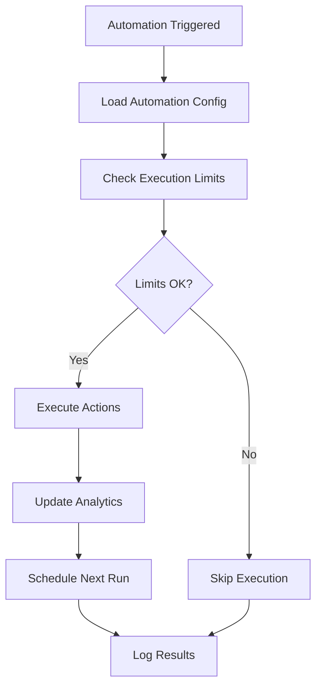

# Automation API Documentation

## Base URL
```
https://api.yourapp.com/api/automations
```

## Table of Contents
- [Automation API Documentation](#automation-api-documentation)
  - [Base URL](#base-url)
  - [Table of Contents](#table-of-contents)
  - [Overview](#overview)
    - [Key Features](#key-features)
    - [Automation Status](#automation-status)
    - [Automation Types](#automation-types)
    - [Trigger Types](#trigger-types)
  - [Authentication & Permissions](#authentication--permissions)
  - [Automation Management](#automation-management)
    - [1. Get All Automations](#1-get-all-automations)
    - [2. Get Automation by ID](#2-get-automation-by-id)
    - [3. Create New Automation](#3-create-new-automation)
    - [4. Update Automation](#4-update-automation)
    - [5. Delete Automation](#5-delete-automation)
  - [Automation Templates](#automation-templates)
    - [6. Get All Templates](#6-get-all-templates)
  - [Automation Control](#automation-control)
    - [7. Start Automation](#7-start-automation)
    - [8. Stop Automation](#8-stop-automation)
    - [9. Pause Automation](#9-pause-automation)
    - [10. Execute Automation Manually](#10-execute-automation-manually)
  - [Automation Analytics](#automation-analytics)
    - [11. Get Automation Analytics](#11-get-automation-analytics)
    - [12. Get Automation Statistics Overview](#12-get-automation-statistics-overview)
  - [Workflow Engine](#workflow-engine)
    - [Execution Flow](#execution-flow)
    - [Scheduling System](#scheduling-system)
    - [Execution Limits](#execution-limits)
  - [Data Models](#data-models)
    - [Automation Object](#automation-object)
    - [Config Object](#config-object)
    - [Analytics Object](#analytics-object)
  - [Error Responses](#error-responses)
    - [Common Error Codes](#common-error-codes)
    - [Automation-Specific Errors](#automation-specific-errors)
  - [Rate Limiting](#rate-limiting)
  - [Security Features](#security-features)
  - [Best Practices](#best-practices)

---

## Overview

The Automation API provides a comprehensive workflow engine for creating, managing, and executing automated social media tasks. Built with enterprise-grade reliability and scalability, it supports complex automation workflows with advanced scheduling, execution limits, and real-time analytics.

### Key Features

- **🔄 Advanced Workflow Engine**: Sophisticated automation execution with trigger-based workflows
- **⏰ Intelligent Scheduling**: Cron-based scheduling with timezone support and execution limits
- **📊 Real-time Analytics**: Comprehensive execution tracking and performance metrics
- **🎯 Multi-Platform Support**: Seamless integration across multiple social media platforms
- **🛡️ Enterprise Security**: Role-based permissions and secure execution environment
- **⚡ High Performance**: Optimized for scale with efficient resource management
- **🔧 Template System**: Pre-built automation templates for quick setup
- **📈 Execution Monitoring**: Real-time status tracking and error handling

### Automation Status

| Status | Description | Behavior |
|--------|-------------|----------|
| `ACTIVE` | Automation is running and executing based on triggers | Scheduled executions will run automatically |
| `INACTIVE` | Automation is stopped and will not execute | No executions will occur |
| `PAUSED` | Automation is temporarily paused | Can be resumed without losing configuration |
| `COMPLETED` | Automation has finished all scheduled executions | Automatically set when max executions reached |
| `FAILED` | Automation encountered critical errors and stopped | Requires manual intervention |

### Automation Types

| Type | Code | Description | Use Cases |
|------|------|-------------|-----------||
| **Post Scheduling** | `POST_SCHEDULING` | Schedule posts for future publication | Content calendar management, optimal timing |
| **Auto Reply** | `AUTO_REPLY` | Automatically respond to comments and messages | Customer service, engagement automation |
| **Content Curation** | `CONTENT_CURATION` | Automatically curate and share relevant content | Content discovery, reposting |
| **Engagement** | `ENGAGEMENT` | Automate likes, follows, and other engagement activities | Audience growth, community building |
| **Analytics Report** | `ANALYTICS_REPORT` | Generate and send periodic analytics reports | Performance tracking, insights delivery |
| **Cross Posting** | `CROSS_POSTING` | Share content across multiple platforms | Multi-platform presence, content syndication |

### Trigger Types

| Type | Code | Description | Configuration |
|------|------|-------------|---------------|
| **Schedule** | `SCHEDULE` | Time-based triggers using cron expressions | Cron pattern, timezone, date range |
| **Event** | `EVENT` | Triggered by platform events (comments, mentions) | Event types, filters, conditions |
| **Condition** | `CONDITION` | Triggered when specific conditions are met | Condition logic, thresholds, operators |
| **Webhook** | `WEBHOOK` | Triggered by external webhook calls | Webhook URL, authentication, payload validation |

## Authentication & Permissions

All automation endpoints require authentication and specific permissions:

| Permission | Description | Required For |
|------------|-------------|-------------|
| `AUTOMATION_LIST` | View automation list | GET /automations |
| `AUTOMATION_READ` | View automation details | GET /automations/:id, GET /templates |
| `AUTOMATION_CREATE` | Create new automations | POST /automations |
| `AUTOMATION_UPDATE` | Modify existing automations | PUT /automations/:id |
| `AUTOMATION_DELETE` | Delete automations | DELETE /automations/:id |
| `AUTOMATION_EXECUTE` | Control automation execution | POST /automations/:id/start, /stop, /pause, /execute |
| `ANALYTICS_READ` | View analytics and statistics | GET /automations/:id/analytics, /stats/overview |

---

## Automation Management

### 1. Get All Automations

**Endpoint:** `GET /api/automations`  
**Description:** Retrieve a paginated list of all automations for the authenticated user with advanced filtering and sorting options.  
**Authentication:** Required  
**Permission:** `AUTOMATION_LIST`

**Query Parameters:**

| Parameter | Type | Default | Description |
|-----------|------|---------|-------------|
| `page` | integer | 1 | Page number for pagination |
| `limit` | integer | 10 | Number of items per page (max: 100) |
| `status` | string | - | Filter by status: `ACTIVE`, `INACTIVE`, `PAUSED`, `COMPLETED`, `FAILED` |
| `type` | string | - | Filter by automation type |
| `search` | string | - | Search in name, description, and tags |
| `sortBy` | string | `createdAt` | Sort field: `createdAt`, `updatedAt`, `name`, `status` |
| `sortOrder` | string | `desc` | Sort order: `asc`, `desc` |

**Example Request:**
```bash
curl -X GET "https://api.yourapp.com/api/automations?page=1&limit=10&status=ACTIVE&sortBy=name" \
  -H "Content-Type: application/json" \
  -H "Authorization: Bearer YOUR_TOKEN"
```

**Response:**
```json
{
  "success": true,
  "data": {
    "automations": [
      {
        "id": "507f1f77bcf86cd799439011",
        "name": "Instagram Engagement Boost",
        "description": "Automatically engage with posts using specific hashtags",
        "type": "ENGAGEMENT",
        "status": "ACTIVE",
        "platformAccounts": [
          {
            "id": "507f1f77bcf86cd799439012",
            "platform": "instagram",
            "username": "@yourhandle"
          }
        ],
        "config": {
          "triggers": [
            {
              "type": "SCHEDULE",
              "schedule": {
                "cron": "0 */2 * * *",
                "timezone": "UTC"
              }
            }
          ],
          "actions": [
            {
              "type": "like_posts",
              "config": {
                "hashtags": ["#photography", "#nature"],
                "maxLikes": 50
              }
            }
          ]
        },
        "maxExecutions": 1000,
        "dailyLimit": 100,
        "monthlyLimit": 3000,
        "executionCount": 45,
        "successCount": 43,
        "failureCount": 2,
        "lastExecutedAt": "2024-01-15T10:30:00Z",
        "nextExecutionAt": "2024-01-15T12:00:00Z",
        "analytics": {
          "totalRuns": 45,
          "successRate": 95.6,
          "avgExecutionTime": 2340,
          "errorCount": 2
        },
        "tags": ["engagement", "growth"],
        "createdAt": "2024-01-01T12:00:00Z",
        "updatedAt": "2024-01-15T10:30:00Z"
      }
    ],
    "pagination": {
      "page": 1,
      "limit": 10,
      "total": 25,
      "totalPages": 3,
      "hasNext": true,
      "hasPrev": false
    }
  },
  "meta": {
    "requestId": "req_123456789"
  }
}
```

### 2. Get Automation by ID
**Endpoint:** `GET /:id`  
**Description:** Specific automation की detailed information return करता है।  
**Authentication:** Required (authMiddleware.authenticate)  
**Permission:** `AUTOMATION_READ`

```bash
curl -X GET http://localhost:3000/api/automations/automation_id_here \
  -H "Content-Type: application/json" \
  -b cookies.txt
```

**Response:**
```json
{
  "success": true,
  "data": {
    "automation": {
      "id": "automation_id",
      "name": "Auto Like Posts",
      "description": "Automatically likes posts with specific hashtags",
      "type": "like_posts",
      "status": "active",
      "platformAccountId": "platform_account_id",
      "settings": {
        "targetHashtags": ["#photography", "#nature"],
        "likesPerHour": 30,
        "maxLikesPerDay": 500,
        "targetAccounts": ["@photographer1", "@naturelover"],
        "avoidRecentlyLiked": true,
        "minFollowers": 100,
        "maxFollowers": 10000
      },
      "schedule": {
        "enabled": true,
        "startTime": "09:00",
        "endTime": "18:00",
        "timezone": "Asia/Kolkata",
        "days": ["monday", "tuesday", "wednesday", "thursday", "friday"]
      },
      "createdAt": "2024-01-01T10:00:00Z",
      "updatedAt": "2024-01-01T11:00:00Z",
      "lastRun": "2024-01-01T11:00:00Z",
      "nextRun": "2024-01-01T12:00:00Z",
      "runCount": 150,
      "successCount": 145,
      "errorCount": 5
    }
  }
}
```

### 3. Create New Automation
**Endpoint:** `POST /`  
**Description:** नया automation create करता है।  
**Authentication:** Required (authMiddleware.authenticate)  
**Permission:** `AUTOMATION_CREATE`  
**Validation:** createAutomationSchema applied

```bash
curl -X POST http://localhost:3000/api/automation \
  -H "Content-Type: application/json" \
  -b cookies.txt \
  -d '{
    "name": "Auto Follow Users",
    "description": "Automatically follow users based on hashtags",
    "type": "follow_users",
    "platformAccountId": "platform_account_id",
    "settings": {
      "targetHashtags": ["#photography", "#travel"],
      "followsPerHour": 20,
      "maxFollowsPerDay": 200,
      "minFollowers": 50,
      "maxFollowers": 5000
    },
    "schedule": {
      "enabled": true,
      "startTime": "10:00",
      "endTime": "17:00",
      "timezone": "Asia/Kolkata",
      "days": ["monday", "tuesday", "wednesday", "thursday", "friday"]
    }
  }'
```

**Response:**
```json
{
  "success": true,
  "message": "Automation created successfully",
  "data": {
    "automation": {
      "id": "new_automation_id",
      "name": "Auto Follow Users",
      "description": "Automatically follow users based on hashtags",
      "type": "follow_users",
      "status": "paused",
      "platformAccountId": "platform_account_id",
      "settings": {
        "targetHashtags": ["#photography", "#travel"],
        "followsPerHour": 20,
        "maxFollowsPerDay": 200,
        "minFollowers": 50,
        "maxFollowers": 5000
      },
      "schedule": {
        "enabled": true,
        "startTime": "10:00",
        "endTime": "17:00",
        "timezone": "Asia/Kolkata",
        "days": ["monday", "tuesday", "wednesday", "thursday", "friday"]
      },
      "createdAt": "2024-01-01T12:00:00Z",
      "updatedAt": "2024-01-01T12:00:00Z"
    }
  }
}
```

### 4. Update Automation
**Endpoint:** `PUT /:id`  
**Description:** Existing automation को update करता है।  
**Authentication:** Required (authMiddleware.authenticate)  
**Permission:** `AUTOMATION_UPDATE`  
**Validation:** updateAutomationSchema applied

```bash
curl -X PUT http://localhost:3000/api/automations/automation_id_here \
  -H "Content-Type: application/json" \
  -b cookies.txt \
  -d '{
    "name": "Updated Auto Like Posts",
    "settings": {
      "targetHashtags": ["#photography", "#nature", "#landscape"],
      "likesPerHour": 25,
      "maxLikesPerDay": 400
    },
    "schedule": {
      "enabled": true,
      "startTime": "08:00",
      "endTime": "20:00"
    }
  }'
```

**Response:**
```json
{
  "success": true,
  "message": "Automation updated successfully",
  "data": {
    "automation": {
      "id": "automation_id",
      "name": "Updated Auto Like Posts",
      "description": "Automatically likes posts with specific hashtags",
      "type": "like_posts",
      "status": "active",
      "settings": {
        "targetHashtags": ["#photography", "#nature", "#landscape"],
        "likesPerHour": 25,
        "maxLikesPerDay": 400
      },
      "schedule": {
        "enabled": true,
        "startTime": "08:00",
        "endTime": "20:00",
        "timezone": "Asia/Kolkata",
        "days": ["monday", "tuesday", "wednesday", "thursday", "friday"]
      },
      "updatedAt": "2024-01-01T13:00:00Z"
    }
  }
}
```

### 5. Delete Automation
**Endpoint:** `DELETE /:id`  
**Description:** Automation को permanently delete करता है।  
**Authentication:** Required (authMiddleware.authenticate)  
**Permission:** `AUTOMATION_DELETE`

```bash
curl -X DELETE http://localhost:3000/api/automations/automation_id_here \
  -H "Content-Type: application/json" \
  -b cookies.txt
```

**Response:**
```json
{
  "success": true,
  "message": "Automation deleted successfully"
}
```

---

## Automation Templates

### 6. Get All Templates
**Endpoint:** `GET /templates`  
**Description:** Available automation templates की list return करता है।  
**Authentication:** Required (authMiddleware.authenticate)  
**Permission:** `AUTOMATION_LIST`

```bash
curl -X GET http://localhost:3000/api/automations/templates \
  -H "Content-Type: application/json" \
  -b cookies.txt
```

**Response:**
```json
{
  "success": true,
  "data": {
    "templates": [
      {
        "id": "template_1",
        "name": "Hashtag Engagement",
        "description": "Automatically like and comment on posts with specific hashtags",
        "type": "engagement",
        "category": "growth",
        "defaultSettings": {
          "targetHashtags": [],
          "likesPerHour": 30,
          "commentsPerHour": 10,
          "maxActionsPerDay": 500
        },
        "features": ["auto_like", "auto_comment", "hashtag_targeting"],
        "popularity": 95
      },
      {
        "id": "template_2",
        "name": "Follow Back Automation",
        "description": "Automatically follow back users who follow you",
        "type": "follow_back",
        "category": "engagement",
        "defaultSettings": {
          "followBackDelay": 300,
          "maxFollowsPerDay": 100
        },
        "features": ["auto_follow_back", "delay_control"],
        "popularity": 87
      }
    ]
  }
}
```

---

## Automation Control

### 7. Start Automation
**Endpoint:** `POST /:id/start`  
**Description:** Paused या stopped automation को start करता है।  
**Authentication:** Required (authMiddleware.authenticate)  
**Permission:** `AUTOMATION_START`

```bash
curl -X POST http://localhost:3000/api/automations/automation_id_here/start \
  -H "Content-Type: application/json" \
  -b cookies.txt
```

**Response:**
```json
{
  "success": true,
  "message": "Automation started successfully",
  "data": {
    "automation": {
      "id": "automation_id",
      "status": "active",
      "startedAt": "2024-01-01T14:00:00Z",
      "nextRun": "2024-01-01T14:30:00Z"
    }
  }
}
```

### 8. Stop Automation
**Endpoint:** `POST /:id/stop`  
**Description:** Running automation को stop करता है।  
**Authentication:** Required (authMiddleware.authenticate)  
**Permission:** `AUTOMATION_STOP`

```bash
curl -X POST http://localhost:3000/api/automations/automation_id_here/stop \
  -H "Content-Type: application/json" \
  -b cookies.txt
```

**Response:**
```json
{
  "success": true,
  "message": "Automation stopped successfully",
  "data": {
    "automation": {
      "id": "automation_id",
      "status": "stopped",
      "stoppedAt": "2024-01-01T14:30:00Z"
    }
  }
}
```

### 9. Pause Automation
**Endpoint:** `POST /:id/pause`  
**Description:** Running automation को temporarily pause करता है।  
**Authentication:** Required (authMiddleware.authenticate)  
**Permission:** `AUTOMATION_PAUSE`

```bash
curl -X POST http://localhost:3000/api/automations/automation_id_here/pause \
  -H "Content-Type: application/json" \
  -b cookies.txt
```

**Response:**
```json
{
  "success": true,
  "message": "Automation paused successfully",
  "data": {
    "automation": {
      "id": "automation_id",
      "status": "paused",
      "pausedAt": "2024-01-01T14:45:00Z"
    }
  }
}
```

### 10. Execute Automation Manually
**Endpoint:** `POST /:id/execute`  
**Description:** Automation को manually execute करता है (schedule के बिना)।  
**Authentication:** Required (authMiddleware.authenticate)  
**Permission:** `AUTOMATION_EXECUTE`

```bash
curl -X POST http://localhost:3000/api/automations/automation_id_here/execute \
  -H "Content-Type: application/json" \
  -b cookies.txt
```

**Response:**
```json
{
  "success": true,
  "message": "Automation executed successfully",
  "data": {
    "execution": {
      "id": "execution_id",
      "automationId": "automation_id",
      "status": "completed",
      "startedAt": "2024-01-01T15:00:00Z",
      "completedAt": "2024-01-01T15:05:00Z",
      "actionsPerformed": 25,
      "errors": 0
    }
  }
}
```

---

## Automation Analytics

### 11. Get Automation Analytics
**Endpoint:** `GET /:id/analytics`  
**Description:** Specific automation के performance analytics return करता है।  
**Authentication:** Required (authMiddleware.authenticate)  
**Permission:** `AUTOMATION_ANALYTICS`

**Query Parameters:**
- `period` (optional): Time period (7d, 30d, 90d, 1y) - default: 30d
- `metrics` (optional): Specific metrics to include

```bash
curl -X GET "http://localhost:3000/api/automations/automation_id_here/analytics?period=30d" \
  -H "Content-Type: application/json" \
  -b cookies.txt
```

**Response:**
```json
{
  "success": true,
  "data": {
    "analytics": {
      "automationId": "automation_id",
      "period": "30d",
      "summary": {
        "totalRuns": 150,
        "successfulRuns": 145,
        "failedRuns": 5,
        "totalActions": 4500,
        "successRate": 96.67,
        "averageActionsPerRun": 30
      },
      "dailyStats": [
        {
          "date": "2024-01-01",
          "runs": 5,
          "actions": 150,
          "errors": 0,
          "successRate": 100
        }
      ],
      "actionBreakdown": {
        "likes": 3000,
        "comments": 800,
        "follows": 500,
        "unfollows": 200
      },
      "performance": {
        "averageRunDuration": 300,
        "peakHours": ["10:00", "14:00", "18:00"],
        "bestPerformingDays": ["monday", "wednesday", "friday"]
      }
    }
  }
}
```

### 12. Get Automation Statistics Overview
**Endpoint:** `GET /stats`  
**Description:** User के सभी automations का overall statistics overview return करता है।  
**Authentication:** Required (authMiddleware.authenticate)  
**Permission:** `AUTOMATION_ANALYTICS`

```bash
curl -X GET http://localhost:3000/api/automations/stats/overview \
  -H "Content-Type: application/json" \
  -b cookies.txt
```

**Response:**
```json
{
  "success": true,
  "data": {
    "overview": {
      "totalAutomations": 25,
      "activeAutomations": 15,
      "pausedAutomations": 8,
      "stoppedAutomations": 2,
      "totalActionsToday": 1250,
      "totalActionsThisMonth": 45000
    },
    "performance": {
      "averageSuccessRate": 94.5,
      "totalSuccessfulActions": 42750,
      "totalFailedActions": 2250,
      "mostActiveAutomation": {
        "id": "automation_id",
        "name": "Auto Like Posts",
        "actionsToday": 150
      }
    },
    "trends": {
      "actionsGrowth": 12.5,
      "successRateChange": 2.1,
      "newAutomationsThisMonth": 3
    },
    "typeBreakdown": {
      "like_posts": 10,
      "follow_users": 8,
      "comment_posts": 4,
      "unfollow_users": 3
    }
  }
}
```

---

## Workflow Engine

The automation system is powered by a sophisticated workflow engine that handles execution, scheduling, and monitoring of automation tasks.

### Execution Flow



**Execution Process:**

1. **Trigger Detection**: System monitors for scheduled triggers, events, or manual executions
2. **Validation**: Checks automation status, execution limits, and platform account validity
3. **Action Execution**: Processes each action in the automation configuration
4. **Analytics Update**: Records execution metrics, success/failure rates, and performance data
5. **Scheduling**: Calculates and sets next execution time for scheduled automations
6. **Cleanup**: Handles completed automations and manages resource cleanup

### Scheduling System

The system uses **node-cron** for advanced scheduling capabilities:

**Features:**
- Cron expression support with timezone handling
- Dynamic scheduling and unscheduling
- Execution limit enforcement
- Automatic cleanup of completed automations

**Cron Expression Examples:**
```bash
# Every 2 hours
0 */2 * * *

# Daily at 9 AM
0 9 * * *

# Weekdays at 10 AM and 3 PM
0 10,15 * * 1-5

# Every 30 minutes during business hours
*/30 9-17 * * 1-5
```

### Execution Limits

The system enforces multiple types of execution limits:

| Limit Type | Description | Behavior When Reached |
|------------|-------------|----------------------|
| **Max Executions** | Total lifetime executions | Automation status set to `COMPLETED` |
| **Daily Limit** | Maximum executions per day | Skip execution until next day |
| **Monthly Limit** | Maximum executions per month | Skip execution until next month |
| **Rate Limiting** | Platform-specific rate limits | Automatic throttling and retry |

## Data Models

### Automation Object

```typescript
interface Automation {
  id: string;                    // Unique automation identifier
  userId: string;                // Owner user ID
  name: string;                  // Automation name
  description?: string;          // Optional description
  type: AutomationType;          // Automation type enum
  status: AutomationStatus;      // Current status
  config: AutomationConfig;      // Triggers and actions configuration
  platformAccounts: string[];   // Associated platform account IDs
  maxExecutions?: number;        // Maximum lifetime executions
  dailyLimit?: number;          // Daily execution limit
  monthlyLimit?: number;        // Monthly execution limit
  executionCount: number;       // Total executions performed
  successCount: number;         // Successful executions
  failureCount: number;         // Failed executions
  lastExecutedAt?: Date;        // Last execution timestamp
  nextExecutionAt?: Date;       // Next scheduled execution
  analytics: AnalyticsData;     // Performance metrics
  tags: string[];               // Categorization tags
  createdAt: Date;              // Creation timestamp
  updatedAt: Date;              // Last update timestamp
  deletedAt?: Date;             // Soft deletion timestamp
}
```

### Config Object

```typescript
interface AutomationConfig {
  triggers: Trigger[];          // Array of trigger configurations
  actions: Action[];            // Array of action configurations
}

interface Trigger {
  type: TriggerType;           // SCHEDULE, EVENT, CONDITION, WEBHOOK
  schedule?: {                 // For SCHEDULE triggers
    cron: string;              // Cron expression
    timezone?: string;         // Timezone (default: UTC)
    startDate?: Date;          // Optional start date
    endDate?: Date;            // Optional end date
  };
  event?: {                    // For EVENT triggers
    platform: string;          // Platform identifier
    eventType: string;         // Event type (comment, mention, etc.)
    filters?: object;          // Event filtering criteria
  };
  condition?: {                // For CONDITION triggers
    field: string;             // Field to monitor
    operator: string;          // Comparison operator
    value: any;                // Comparison value
  };
  webhook?: {                  // For WEBHOOK triggers
    url: string;               // Webhook endpoint
    secret?: string;           // Webhook secret for validation
  };
}

interface Action {
  type: string;                // Action type identifier
  platform?: string;          // Target platform
  config: object;              // Action-specific configuration
  retryPolicy?: {              // Retry configuration
    maxRetries: number;
    backoffMs: number;
  };
}
```

### Analytics Object

```typescript
interface AnalyticsData {
  totalRuns: number;           // Total execution count
  successRate: number;         // Success percentage (0-100)
  avgExecutionTime: number;    // Average execution time in milliseconds
  errorCount: number;          // Total error count
  lastError?: string;          // Last error message
  performanceMetrics?: {       // Detailed performance data
    minExecutionTime: number;
    maxExecutionTime: number;
    p95ExecutionTime: number;
  };
}
```

## Error Responses

सभी endpoints निम्नलिखित error format का उपयोग करते हैं:

```json
{
  "success": false,
  "message": "Error message here",
  "error": {
    "code": "ERROR_CODE",
    "details": "Detailed error information"
  }
}
```

### Common Error Codes:
- `400` - Bad Request (Invalid input data)
- `401` - Unauthorized (Authentication required)
- `403` - Forbidden (Insufficient permissions)
- `404` - Not Found (Automation not found)
- `409` - Conflict (Automation already running/stopped)
- `429` - Too Many Requests (Rate limit exceeded)
- `500` - Internal Server Error

### Automation-Specific Errors:
- `AUTOMATION_NOT_FOUND` - Automation doesn't exist
- `AUTOMATION_ALREADY_RUNNING` - Cannot start already running automation
- `AUTOMATION_NOT_RUNNING` - Cannot stop/pause non-running automation
- `PLATFORM_ACCOUNT_REQUIRED` - Valid Instagram account connection required
- `INVALID_AUTOMATION_TYPE` - Unsupported automation type
- `SCHEDULE_CONFLICT` - Automation schedule conflicts with existing automation

---

## Automation Types

### Available Automation Types:

1. **like_posts** - Automatically like posts based on hashtags/accounts
2. **follow_users** - Automatically follow users based on criteria
3. **unfollow_users** - Automatically unfollow users based on criteria
4. **comment_posts** - Automatically comment on posts with predefined messages
5. **story_view** - Automatically view stories from target accounts
6. **dm_users** - Send direct messages to users (premium feature)

### Settings Schema by Type:

#### Like Posts (`like_posts`):
```json
{
  "targetHashtags": ["#hashtag1", "#hashtag2"],
  "targetAccounts": ["@account1", "@account2"],
  "likesPerHour": 30,
  "maxLikesPerDay": 500,
  "minFollowers": 100,
  "maxFollowers": 10000,
  "avoidRecentlyLiked": true
}
```

#### Follow Users (`follow_users`):
```json
{
  "targetHashtags": ["#hashtag1", "#hashtag2"],
  "followsPerHour": 20,
  "maxFollowsPerDay": 200,
  "minFollowers": 50,
  "maxFollowers": 5000,
  "followBackOnly": false
}
```

#### Comment Posts (`comment_posts`):
```json
{
  "targetHashtags": ["#hashtag1", "#hashtag2"],
  "comments": ["Nice post!", "Great content!", "Amazing!"],
  "commentsPerHour": 10,
  "maxCommentsPerDay": 100,
  "randomizeComments": true
}
```

---

## Best Practices

### Automation Design

**1. Start Simple**
- Begin with basic automations and gradually add complexity
- Test thoroughly in development before deploying to production
- Use descriptive names and documentation for maintainability

**2. Execution Limits**
```json
{
  "maxExecutions": 1000,     // Prevent runaway automations
  "dailyLimit": 50,          // Respect platform limits
  "monthlyLimit": 1000       // Budget management
}
```

**3. Error Handling**
- Always configure retry policies for critical actions
- Monitor automation analytics for failure patterns
- Set up alerts for high failure rates

**4. Performance Optimization**
- Use appropriate trigger types (avoid polling when possible)
- Batch similar actions when supported by platforms
- Monitor execution times and optimize slow automations

### Security Best Practices

**1. Platform Account Management**
- Regularly rotate platform access tokens
- Use least-privilege principle for platform permissions
- Monitor for unauthorized access attempts

**2. Webhook Security**
- Always use webhook secrets for validation
- Implement proper HTTPS endpoints
- Validate all incoming webhook data

**3. Data Privacy**
- Minimize data collection and storage
- Implement proper data retention policies
- Ensure compliance with privacy regulations

### Monitoring and Maintenance

**1. Analytics Monitoring**
```bash
# Monitor key metrics
- Success rate (target: >95%)
- Average execution time
- Error patterns and frequency
- Resource utilization
```

**2. Regular Maintenance**
- Review and update automation configurations quarterly
- Clean up completed or obsolete automations
- Update platform integrations as APIs evolve
- Monitor system performance and scale as needed

**3. Troubleshooting**
- Use automation logs for debugging
- Check platform account status and permissions
- Verify trigger configurations and timing
- Test individual actions in isolation

## Rate Limiting

The API implements rate limiting to ensure fair usage and system stability:

- **100 requests per minute** per user
- **1000 requests per hour** per user
- **10,000 requests per day** per user

Rate limit headers are included in all responses:
```
X-RateLimit-Limit: 100
X-RateLimit-Remaining: 95
X-RateLimit-Reset: 1640995200
```

## Security Features

### Authentication
All endpoints require valid JWT authentication tokens.

### Permissions
Users must have appropriate permissions for automation operations:
- `AUTOMATION_READ`: View automations
- `AUTOMATION_WRITE`: Create/update automations
- `AUTOMATION_DELETE`: Delete automations
- `AUTOMATION_EXECUTE`: Start/stop/execute automations

### Data Protection
- All sensitive data is encrypted at rest
- API communications use HTTPS/TLS encryption
- Webhook secrets are securely stored and validated
